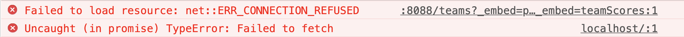
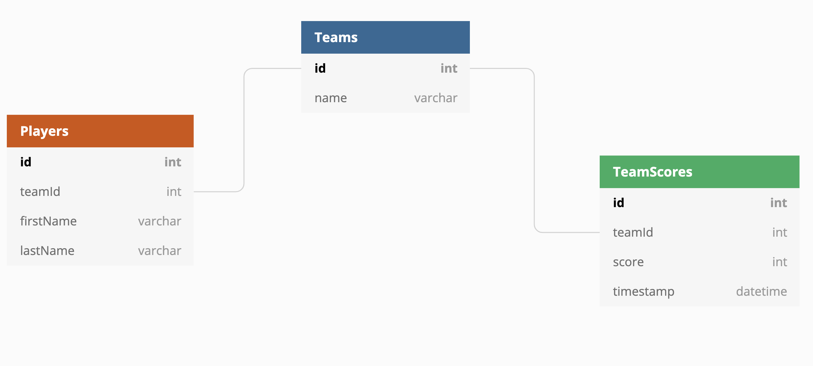

# Truncheons &amp; Flagons

This repo contains a sample implementation of the Truncheons and Flagons JavaScript client application. You will not need to modify any code in this application, but you will need to understand how the data structures and properties are used in order to make the Python API provide the data in the form that is needed.

## Setup

1. Clone this repository to a location of your choosing, and then `cd` into the directory that is created.
1. Run `npm install` to install all dependencies.
1. Run `serve src` to start the web server.
1. Open http://localhost:8080/ in your browser to open the application.

Since there is no working API - which is what you will be building in Python - the UI components will render, but no data will be displayed. Open your dev tools, and you will see that the client's request for data failed since nothing is listening on port 8088 on your machine.

## Diagram

Entity relationship diagram for Truncheons &amp; Flagons API. Use this to design your database tables and to construct your SQL statements as you are building the API logic.

